Hola, soy Javi. Estudio Administración de Sistemas Informáticos en Red (ASIR) en Huelva. Me gusta trastear con lo que tenga por casa y aprender por mi cuenta. Busco prácticas de FP para mayo de 2027.

### En qué estoy

<picture>
  <source media="(prefers-color-scheme: dark)" srcset="assets/estado-oscuro.svg">
  
</picture>

**homelab.** Un mini PC con Debian que filtrará el DNS de la red de casa, con acceso remoto por Tailscale sin abrir puertos y copias cifradas que se hacen solas a diario. Lo documento por fases; el repositorio será público en octubre.

**[jdsantana.com](https://jdsantana.com).** Mi web personal: el CV, el proyecto del servidor y una bitácora con lo que voy haciendo. Se publica sola desde GitHub cada vez que subo un cambio.

**Infraestructura personal.** Dominio propio con el correo bien configurado (SPF, DKIM y DMARC), alias para separar servicios, llaves FIDO2 en las cuentas importantes y una red mesh de tres nodos unidos por cable en casa.

## Últimas entradas de la bitácora

<!-- BLOG-POST-LIST:START -->
<!-- BLOG-POST-LIST:END -->

### Con qué trabajo

**En uso:** Cloudflare DNS, YubiKey (FIDO2) y Git  
**Aprendiendo:** Debian, AdGuard Home, Tailscale, restic y systemd

[hola@jdsantana.com](mailto:hola@jdsantana.com)

English

Hi, I'm Javi. I'm studying Network and Systems Administration (ASIR, a two-year Spanish vocational degree) in Huelva, Spain. I like understanding how the things I use every day work under the hood, and automating repetitive tasks. I'm looking for a vocational training internship for May 2027.

**homelab.** A mini PC running Debian that will filter DNS for the home network, with remote access through Tailscale without opening any ports, and encrypted backups that run on their own every day. I'm documenting it phase by phase, and the repository goes public in October.

**[jdsantana.com](https://jdsantana.com).** My personal website: my CV, the server project and a log of what I'm working on. It deploys itself from GitHub every time I push a change.

**Personal infrastructure.** My own domain with properly configured email (SPF, DKIM and DMARC), aliases to keep services separate, FIDO2 keys on important accounts, and a three-node mesh network with wired backhaul at home.

**In use:** Cloudflare DNS, YubiKey (FIDO2) and Git  
**Learning:** Debian, AdGuard Home, Tailscale, restic and systemd

